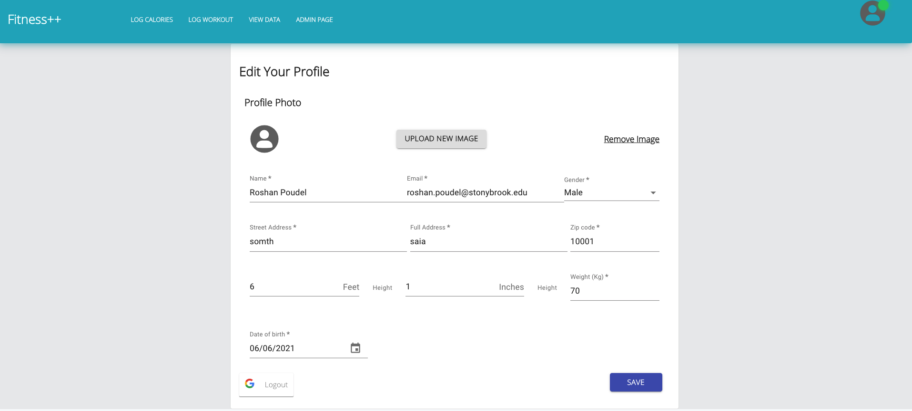

# Fitness++ React Frontend

In the project directory, you can run:

### `npm start`

Runs the app in the development mode.\
Open [http://localhost:3000](http://localhost:3000) to view it in the browser.

## Technologies Used:

<li> React
<li> Material UI
<li> Ednam Food API
<li> Unsplash Image API
<li> Apex Charts, Re-Chart

Online hosting: [https://nostalgic-galileo-9d0824.netlify.app](https://nostalgic-galileo-9d0824.netlify.app)

### Homepage:

By: Sije, Younghwan

### Log Calorie:

By: Roshan

### Log Calorie (nutrition info):

By: Roshan

### Workout:

By: Younghwan

### View Data:

By: Roshan

### Profile Page:

By: Roshan

### Admin Page:

By: Sije

### Google OAuth:

By: Sije

### Online/Offline Display:

By: Sije

